# Prompt Transformer Block Diagram

This diagram is based on the current repository structure and the shared-Herman integration notes in `docs/LLM_Definition_PLAN.md`.

- `Anthropic` is implemented today in `app/services/llm_adapters/anthropic.py`.
- Future connectors are shown with dashed outlines.
- "Herman CQI Database" is represented here as the shared Herman runtime data layer used for profiles, tenant LLM config, secrets, and scoring persistence.

```mermaid
flowchart TB
    classDef api fill:#E8F1FF,stroke:#356AE6,stroke-width:1.5px,color:#102A43;
    classDef system fill:#F6F8FB,stroke:#5B6B7A,stroke-width:1.2px,color:#1F2933;
    classDef engine fill:#EEF8F1,stroke:#2F855A,stroke-width:1.5px,color:#153E2A;
    classDef data fill:#FFF7E8,stroke:#C47F00,stroke-width:1.5px,color:#5F370E;
    classDef llm fill:#FFF0F0,stroke:#C53030,stroke-width:1.5px,color:#63171B;
    classDef future fill:#FFFFFF,stroke:#7A7A7A,stroke-width:1.5px,stroke-dasharray: 6 4,color:#444444;

    subgraph TOP["API Endpoints and Herman Ecosystem"]
        HP["HermanPrompt"]:::system
        HA["Herman Admin<br/>tenant LLM owner"]:::system

        subgraph API["Prompt Transformer API Layer"]
            H["GET /api/health"]:::api
            T["POST /api/transform_prompt"]:::api
            S["GET /api/conversation_scores/{conversation_id}"]:::api
            P["GET /api/profiles/resolve"]:::api
        end
    end

    HP --> T
    HP --> S
    HP --> P
    HA -. shared data ownership .-> DB
    H --> MAIN
    T --> MAIN
    S --> MAIN
    P --> MAIN

    subgraph APP["Prompt Transformer Service"]
        MAIN["FastAPI app<br/>app/main.py + app/api/routes.py"]:::engine
        MAIN --> ORCH

        subgraph ENGINE["Transformer Engine Orchestration<br/>app/services/transformer_engine.py"]
            ORCH["TransformerEngine.transform()"]:::engine
            PR["1. ProfileResolver<br/>summary override or final_profile fallback"]:::engine
            TI["2. TaskInferenceService<br/>task_rules.yaml"]:::engine
            RL["3. RuntimeLlmResolver<br/>authoritative tenant LLM config"]:::engine
            LP["4. LLMPolicyService<br/>llm_policies.yaml fallback rules"]:::engine
            REQ["5. PromptRequirementService<br/>who / task / context / output"]:::engine
            CC["6. ComplianceCheckService"]:::engine
            PC["7. PIICheckService"]:::engine
            PB["8. Deterministic prompt builder<br/>persona + policy + raw prompt"]:::engine
            PS["9. PromptScoringService<br/>heuristic or hybrid score fusion"]:::engine
            LOG["10. RequestLogger"]:::engine

            ORCH --> RL --> PR --> TI --> LP --> REQ
            REQ --> CC
            REQ --> PC
            REQ --> PB
            REQ --> PS
            CC --> PS
            PC --> PS
            PB --> LOG
            PS --> LOG
        end

        subgraph COACH["Coaching / Decision Outcomes"]
            PASS["Result: transformed prompt"]:::engine
            COACHING["Result: coaching tip<br/>missing structure or weak prompt sections"]:::engine
            BLOCK["Result: blocked<br/>high severity compliance / PII finding"]:::engine
        end
    end

    PB --> PASS
    REQ --> COACHING
    CC --> BLOCK
    PC --> BLOCK

    subgraph INNER["Inner Scoring and Structure Logic"]
        SE["StructureEvaluationService<br/>optional LLM semantic evaluator"]:::engine
        TRACE["Requirement merge + trace<br/>heuristic vs evaluator vs fused state"]:::engine
        SCORE["Field scoring<br/>who / task / context / output"]:::engine
        ROLLUP["Conversation rollup persistence<br/>initial / best / final / improvement"]:::engine
    end

    REQ --> SE
    SE --> TRACE
    REQ --> TRACE
    TRACE --> SCORE
    PS --> SCORE
    SCORE --> ROLLUP

    subgraph RULES["Rule Files"]
        RP1["summary_personas.yaml"]:::data
        RP2["task_rules.yaml"]:::data
        RP3["llm_policies.yaml"]:::data
        RP4["llm_provider_profiles.yaml"]:::data
        RP5["prompt_scoring.yaml"]:::data
    end

    PR --> RP1
    TI --> RP2
    LP --> RP3
    SE --> RP4
    PS --> RP5

    subgraph DB["Shared Herman CQI / Runtime Database"]
        DB1["final_profile<br/>persona and enforcement settings"]:::data
        DB2["auth_users -> tenants"]:::data
        DB3["tenant_llm_config<br/>platform_managed_llm_configs"]:::data
        DB4["vault_secrets"]:::data
        DB5["conversation_prompt_scores"]:::data
        DB6["request_log"]:::data
    end

    PR --> DB1
    RL --> DB2
    RL --> DB3
    RL --> DB4
    PS --> DB5
    LOG --> DB6
    S --> DB5
    P --> DB1

    subgraph GATEWAY["LLM Gateway and Connector Modules"]
        GW["LlmGatewayService"]:::llm
        REG["LlmAdapterRegistry"]:::llm
        OAI["OpenAI adapter"]:::llm
        AZ["Azure OpenAI adapter"]:::llm
        XAI["xAI adapter"]:::llm
        ANT["Anthropic adapter"]:::llm
        GEM["Google Gemini adapter"]:::future
        BED["AWS Bedrock adapter"]:::future
        COH["Cohere adapter"]:::future
        MIS["Mistral adapter"]:::future
    end

    SE --> GW
    GW --> REG
    REG --> OAI
    REG --> AZ
    REG --> XAI
    REG --> ANT
    REG -. future .-> GEM
    REG -. future .-> BED
    REG -. future .-> COH
    REG -. future .-> MIS
```

